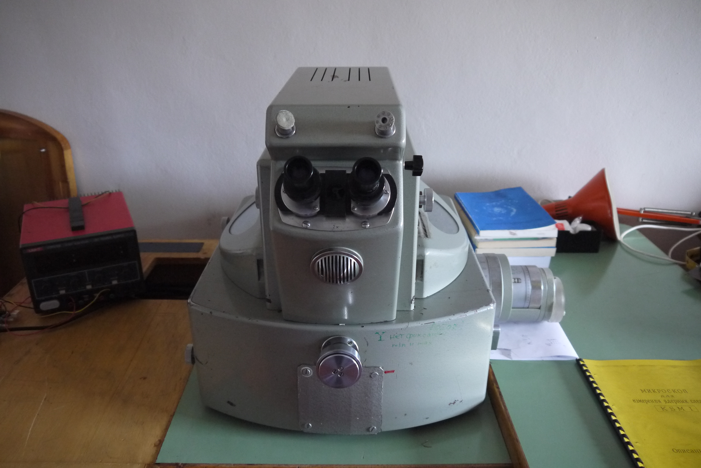
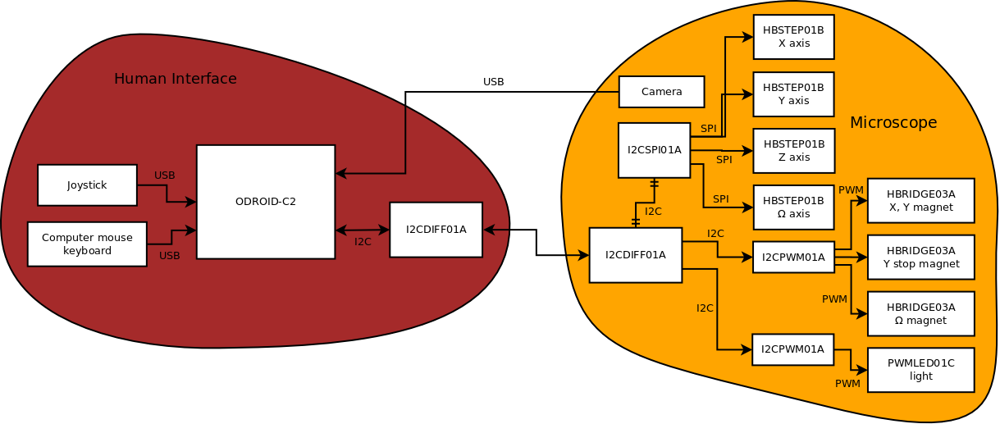
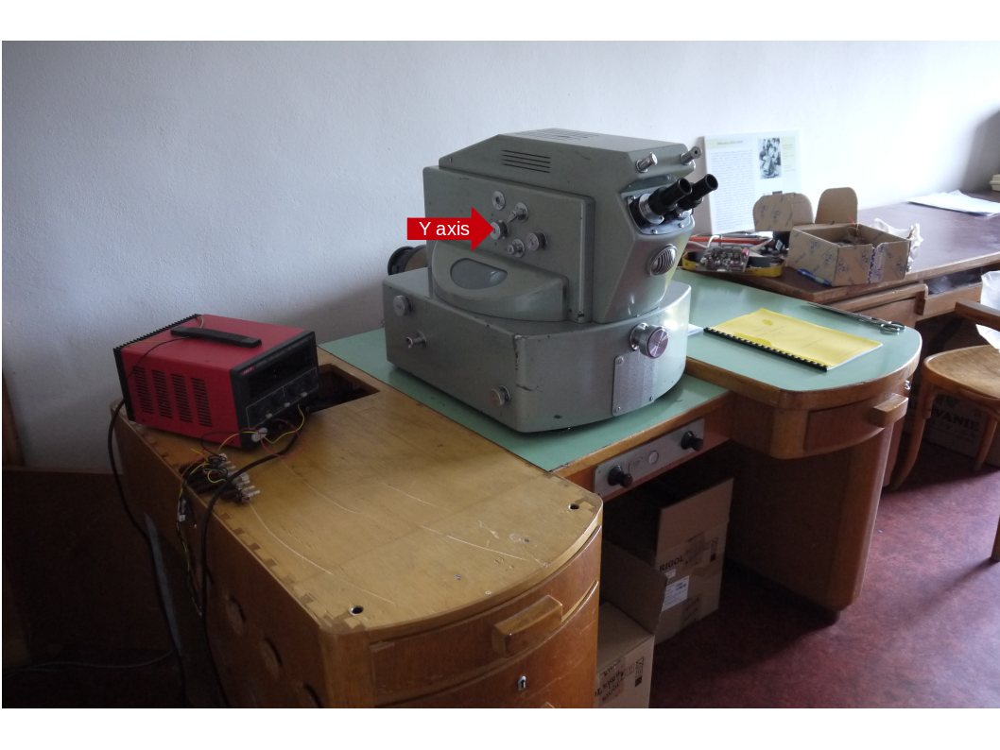
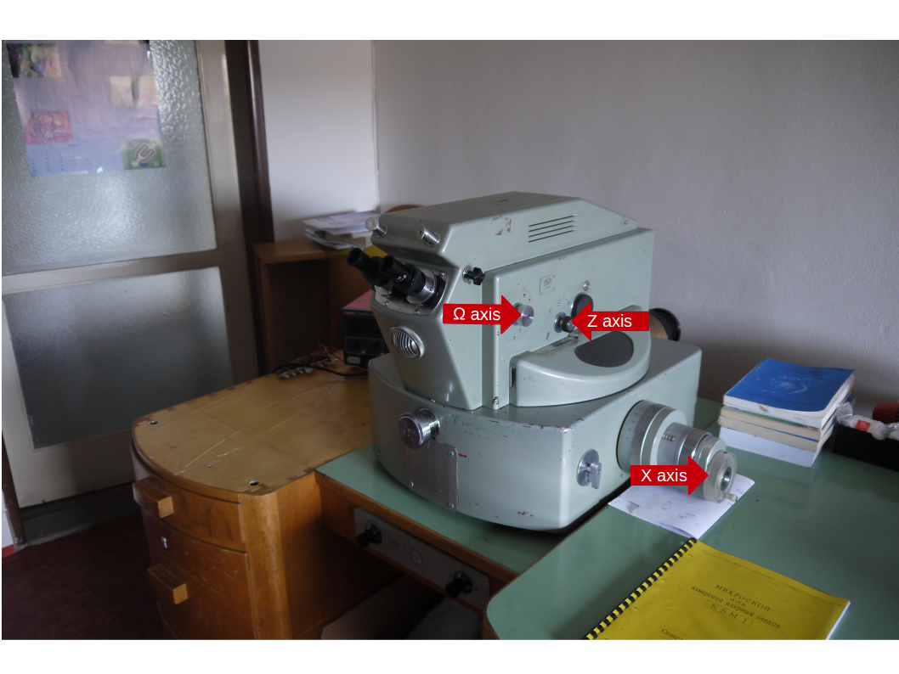

# KSM 1 nuclear emulsion microscope renovation 

The KSM 1 is old soviet microscope used for [nuclear emulsion](https://en.wikipedia.org/wiki/Nuclear_emulsion) inpection and analysis. The process was exclusively manual work, which needs tireless eye scannig of nuclear emulsion plate.
Although nuclear emulsions could be partially superseded by new types of active ionizing radiation detectors, there still exists applications, where nuclear emulsions fit the best. Therefore we were asked by the [Czech Nuclear physics institute](http://www.ujf.cas.cz/en/) to make automation of the old fashioned KSM emulsion expection microscope. 

The microscope looks like in the following photo, before renovation. 

We equip the nuclear emulsion plate moving axes by stepper motors. The motors are controlled from signge board computer trought some [mlab.cz modules](https://www.mlab.cz/modules). The block schematics follows: 

The KSM microscope hardware is now capable to 

  * Control of the three clutch magnets through the new interface.
  * Control of the three moving axis and one rotation angle through the new interface.
  * Control of the camera light source intensity through the interface. The camera was also installed. 
 

The software development to control synchronization of the movements and scannig automatization was left on [Czech Nuclear physics institute](http://www.ujf.cas.cz/en/) as was clarified in the contract. 

